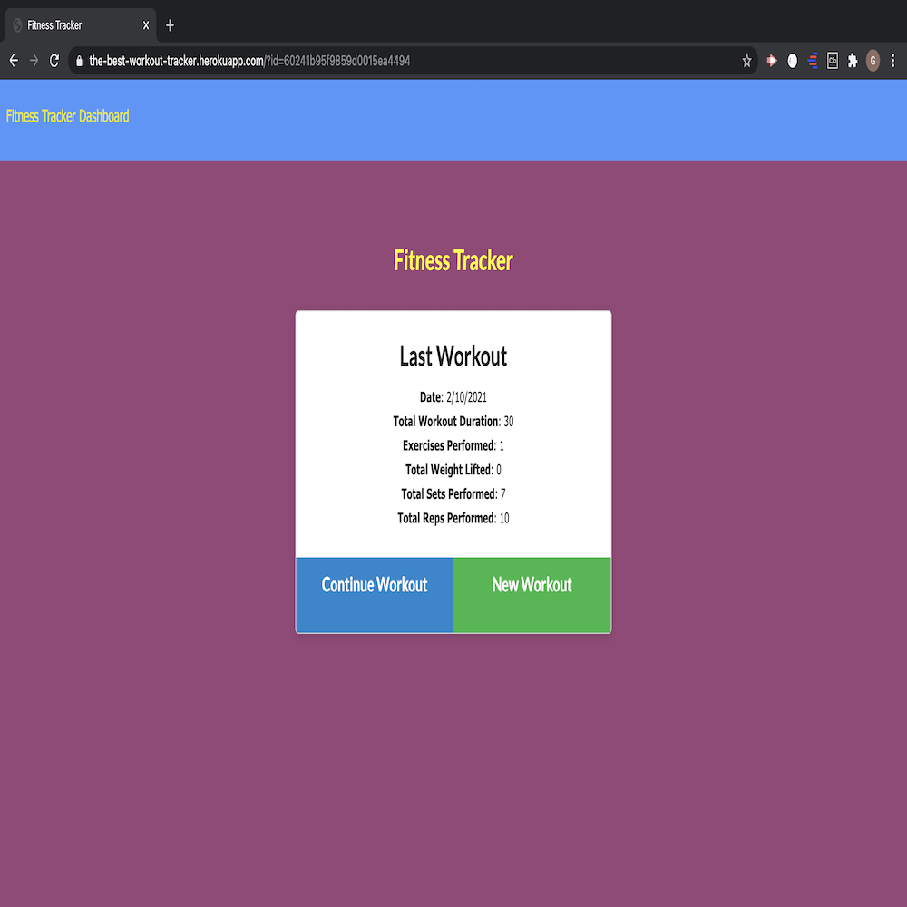
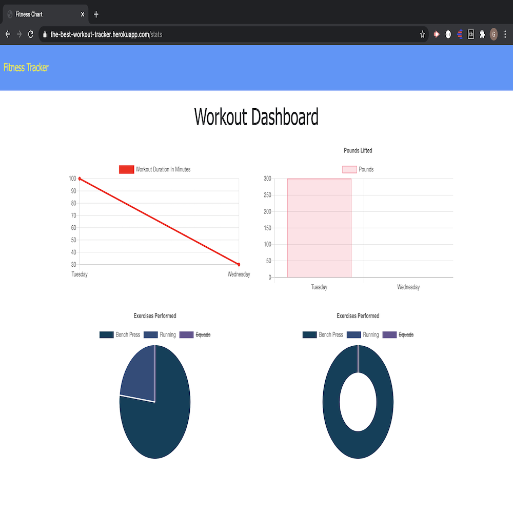

# workout_tracker app

# Description

As a user, I want to be able to view create and track daily workouts. I want to be able to log multiple exercises in a workout on a given day. I should also be able to track the name, type, weight, sets, reps, and duration of exercise. If the exercise is a cardio exercise, I should be able to track my distance traveled.

When the user loads the page, they will be given the option to create a new workout or continue with their last workout. The user will be able to add exercises to the most recent workout plan the user has. The user can also add new exercises to a new workout plan. Once the user has added the exercises he/she wants, then the user can view the combined weight of multiple exercises from the past seven workouts on the stats page. The user can also view the total duration of each workout from the past seven workouts on the stats page.

# Links: 

GitHub Link: https://github.com/Guled06/workout_tracker

Heroku Link: https://the-best-workout-tracker.herokuapp.com/?id=60241b95f9859d0015ea4494

# Screenshot of App:

